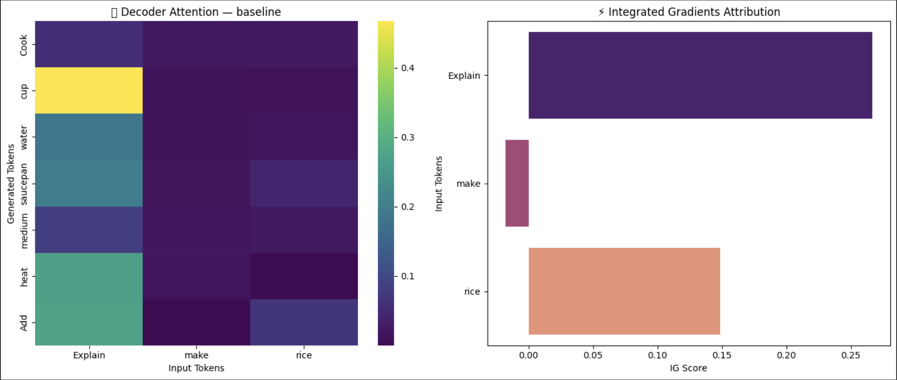
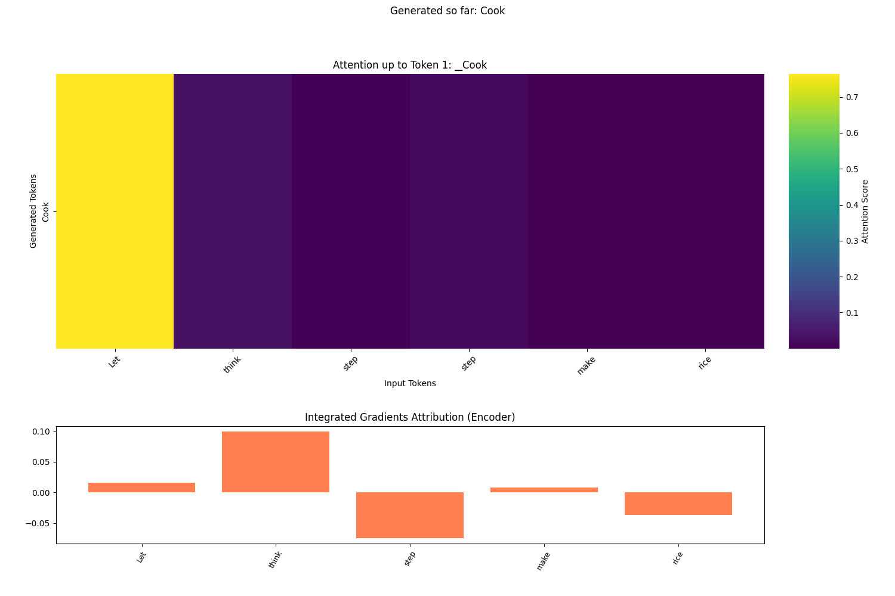
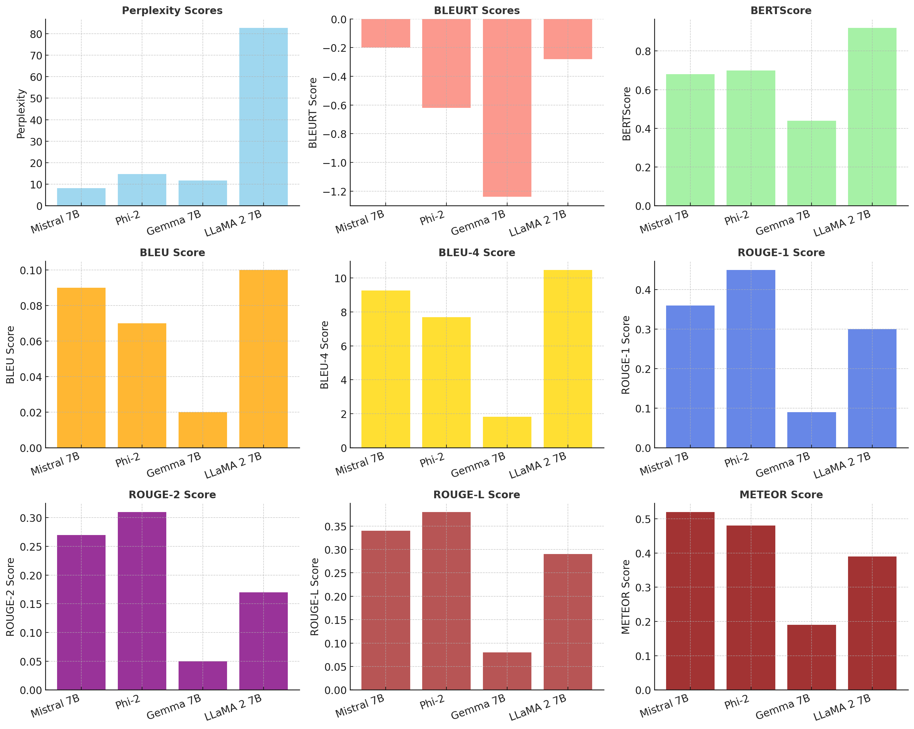

# Prompt Matters: Evaluating and Explaining LLM Behavior via Prompt Engineering and XAI

A unified pipeline for probing, explaining, and visualizing how prompt design shapes both the outputs and internal reasoning of large language models.

---

## 1. Features

- **Prompt Variation**  
  Ten topics × ten prompt styles:  
  - Baseline  
  - Role-specific  
  - Free-text Chain-of-Thought (CoT)  
  - Numbered CoT  
  - Few-shot  
  - One-shot  
  - Adversarial  
  - Ambiguous  
  - Explain + Justify  
  - Role-play  

- **Model Comparison**  
  - Open-source: Mistral 7B, Phi-2, Zephyr 7B, FLAN-T5-Large  
  - Closed-API: Gemini 1.5 Pro  

- **Retrieval Augmentation**  
  - RAG-Token-NQ with legacy dummy index to ground generation  

- **Explainability**  
  - Decoder attention heatmaps (averaged over layers & heads)  
  - Encoder Integrated Gradients attributions (Captum)  
  - SHAP analyses and UMAP clustering of SBERT embeddings  

- **Metrics**  
  - BLEURT  
  - BERTScore  
  - GPT-2 perplexity  
  - SBERT-cosine faithfulness  
  - TruthfulQA hallucination rates  
  - Role-consistency scores  

- **Visualization**  
  - Static dashboards
    
  - Animated GIFs showing attention + IG across prompt styles
    
## 4. Analyze Metrics

Open `results_with_rag.csv` in your tool of choice (Pandas, Excel, etc.) to compare:

- **BLEURT**
- **BERTScore**
- **Perplexity**
- **BLUE**
- **BLUE-4**
- **ROUGE**
- **METEOR**
across all prompt styles.

---

## 5. Key Insights

- **Structured Prompts** (numbered CoT, role-specific)  
  Concentrate attention on critical tokens and boost faithfulness.

- **Example-Based Prompts** (few-shot / one-shot)  
  Transfer stylistic patterns but may over-emphasize exemplar wording.

- **Adversarial / Ambiguous Prompts**  
  Diffuse model focus and inflate hallucinations.

- **RAG Grounding**  
  Anchors attention to retrieved evidence, lowering perplexity and hallucination rates.

